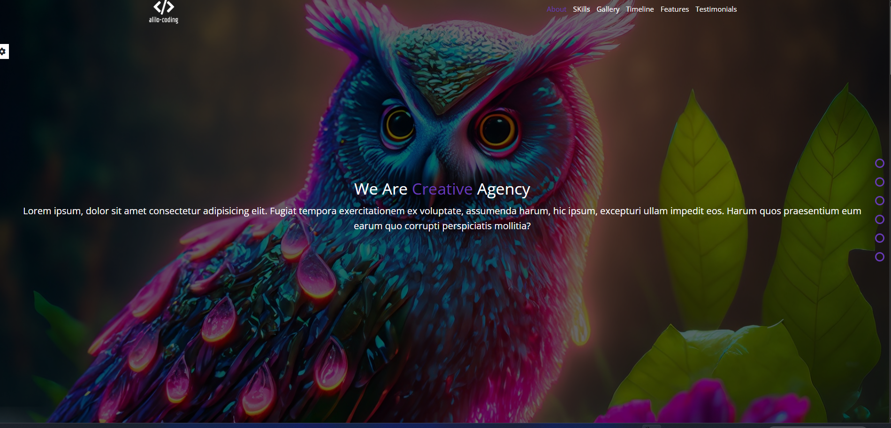
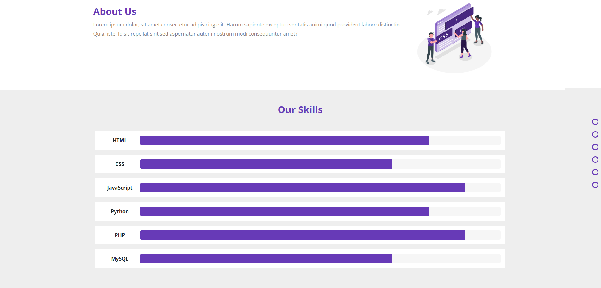
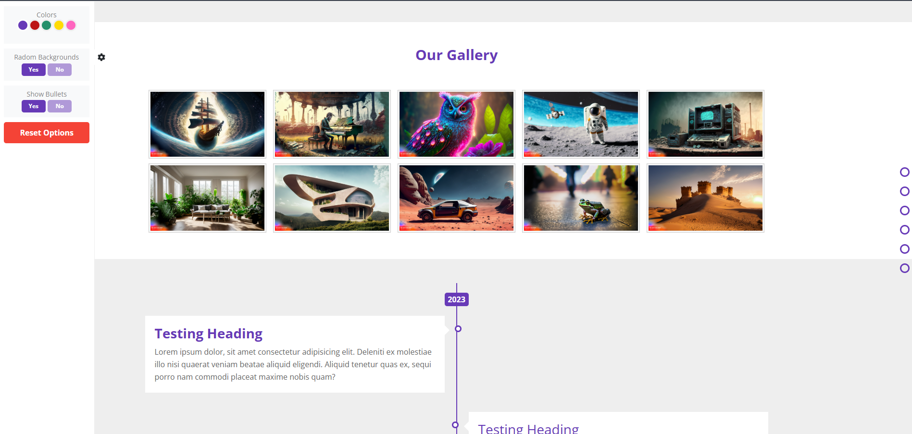
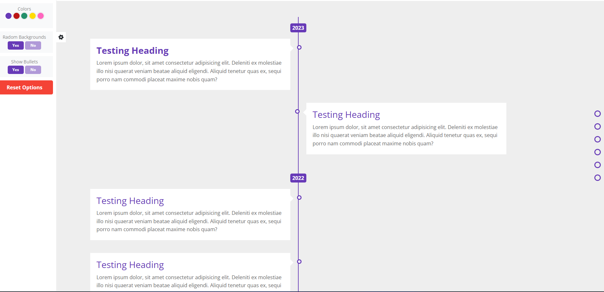
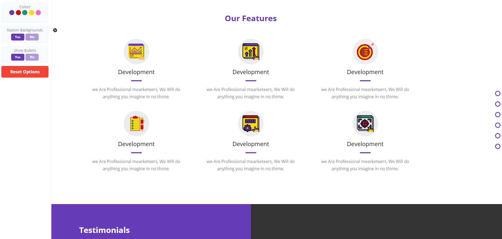
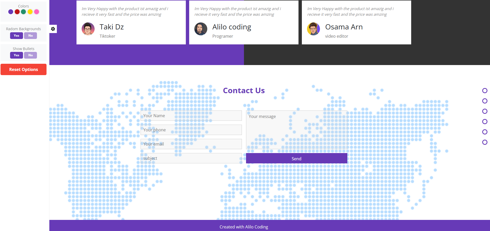

# Alilo Coding — Creative Agency Website Template

🌐 Websites. A feature-rich, single-page website template built with **Bootstrap 5**, **CSS Custom Properties**, and **Vanilla JavaScript (ES6+)**. Features a live settings panel with **5 color themes**, **localStorage persistence**, a **gallery lightbox**, **scroll-triggered skill bars**, and auto-generated **side navigation bullets**.

---

## 📸 Preview

| | |
|---|---|
|  |  |
|  |  |
|  |  |

---

## ✨ Features

### 🎨 Settings Panel
- **5 Live Color Themes** — Purple, Red, Green, Yellow, and Pink, switched instantly via CSS Custom Properties (`--main-color`) with no page reload
- **Random Background Toggle** — Enables/disables an auto-rotating hero background slideshow (changes every 3 seconds)
- **Show/Hide Side Bullets** — Toggle the fixed side navigation bullets on or off
- **Reset Button** — Clears all saved preferences and restores defaults
- **localStorage Persistence** — All user settings (color, background mode, bullets visibility) are saved in the browser and restored on the next visit

### 📐 Layout & Sections
- **Full-Viewport Hero** — Landing page with 5 background images and an animated intro text overlay
- **About Us** — Two-column layout; the illustration image changes dynamically to match the selected color theme
- **Skills** — Animated progress bars that fill on scroll (scroll-triggered animation)
- **Gallery** — 10-image grid with a custom **Vanilla JS lightbox/popup** (no plugins)
- **Timeline** — Left/right alternating event cards grouped by year
- **Features** — Six feature cards with custom icon illustrations
- **Testimonials** — Three client review cards with profile pictures and roles
- **Contact Form** — Full contact form with name, phone, email, subject, and message fields
- **Side Navigation Bullets** — Auto-generated from navbar links; clicking any bullet smoothly scrolls to the matching section
- **Responsive Hamburger Menu** — Mobile navbar toggle with click-outside-to-close behavior

---

## 🗂️ Project Structure

```
tmplelet/
├── index.html                  # Single-page application entry point
│
├── css/
│   ├── master.css              # Custom styles & CSS variables (--main-color)
│   ├── myFramework.css         # Custom utility CSS framework (spacing, borders, etc.)
│   ├── bootstrap.min.css       # Bootstrap 5 core styles
│   ├── all.min.css             # Font Awesome 6 (self-hosted)
│   └── normalize.css           # Cross-browser style reset
│
├── js/
│   ├── master.js               # All custom JavaScript logic
│   ├── bootstrap.bundle.min.js # Bootstrap 5 JS + Popper
│   └── all.min.js              # Font Awesome JS (currently commented out)
│
├── imgs/
│   ├── img1.jpg – img10.jpg    # Hero + gallery images
│   ├── amico-673ab7.png        # About Us illustration — Purple theme
│   ├── amico-bc1616.png        # About Us illustration — Red theme
│   ├── amico-23906b.png        # About Us illustration — Green theme
│   ├── amico-ffdb03.png        # About Us illustration — Yellow theme
│   ├── amico-ff66bf.png        # About Us illustration — Pink theme
│   ├── alio coding.png         # Logo
│   ├── a.png, b.png, o.png     # Testimonial avatars
│   ├── stat.png, analytic.png,
│   │   feature-selection.png,
│   │   features.png,
│   │   web-management.png,
│   │   goal.png                # Feature section illustrations
│   └── World_map.png           # World map graphic
│
├── webfonts/                   # Self-hosted Font Awesome 6 font files
│   ├── fa-solid-900.*
│   ├── fa-brands-400.*
│   ├── fa-regular-400.*
│   └── fa-v4compatibility.*
│
└── imageGithub/                # Preview screenshots for README
    └── 1.png – 6.png
```

---

## ⚙️ JavaScript Features (master.js)

All interactivity is written in pure **Vanilla JavaScript (ES6+)** — no jQuery, no external JS libraries.

| Feature | How It Works |
|---|---|
| **Live color switching** | Updates `--main-color` CSS variable on `document.documentElement` and saves to `localStorage` |
| **Theme-aware illustration** | Changes the About Us image src to match the hex color of the selected theme |
| **Random background slideshow** | `setInterval` every 3s picks a random image, removes `.active` from all, adds it to the chosen one |
| **Scroll-triggered skill bars** | `window.onscroll` compares `pageYOffset` vs section `offsetTop` to trigger `width` animation |
| **Gallery lightbox** | Creates overlay + popup box + image + close button dynamically via DOM API on image click |
| **Side nav bullets** | Auto-generated from `data-section` attributes on navbar links; delegates smooth scroll |
| **Smooth scroll navigation** | `scrollIntoView({ behavior: "smooth" })` on both nav links and side bullets |
| **Settings persistence** | `localStorage.getItem/setItem/removeItem` for color, background mode, and bullets visibility |
| **Reset options** | Removes all 4 localStorage keys and calls `window.location.reload()` |
| **Mobile menu** | `classList.toggle("open")` on hamburger click; `e.stopPropagation()` prevents document click from closing it immediately |

---

## 🎨 Color Themes

The template ships with **5 built-in themes**, all driven by a single CSS custom property:

```css
:root {
  --main-color: #673ab7; /* default: Purple */
}
```

| Theme | Color Code | Preview |
|---|---|---|
| 🟣 Purple | `#673ab7` | Default |
| 🔴 Red | `#bc1616` | — |
| 🟢 Green | `#23906b` | — |
| 🟡 Yellow | `#ffdb03` | — |
| 🩷 Pink | `#ff66bf` | — |

To add a new theme, add a new `<li>` to `.colors-list` in `index.html` with your hex color as `data-color`, and place a matching `amico-XXXXXX.png` illustration in `imgs/`.

---

## 🛠️ Custom Utility Framework (`myFramework.css`)

The project includes a hand-built utility class library, similar in spirit to Tailwind CSS:

```css
/* Spacing */
.pad-0   .pad-5   .pad-10   .pad-20
.mar-0   .mar-5   .mar-10

/* Directional padding */
.p-lef-20   .p-rig-20   .p-top-bot-20

/* Border radius */
.b-rad-5-px

/* Miscellaneous */
.c-point    /* cursor: pointer */
.r-none     /* resize: none */
```

---

## 📄 Sections Overview

| Section | Key Details |
|---|---|
| **Landing Page** | Full-viewport hero, 5 random-rotating background images, overlay, intro text |
| **About Us** | Text + dynamic illustration that updates with the active color theme |
| **Skills** | 6 skills: HTML (80%), CSS (70%), JavaScript (90%), Python (80%), PHP (90%), MySQL (70%) |
| **Gallery** | 10 images, click any to open a Vanilla JS lightbox popup |
| **Timeline** | 2022–2023 alternating left/right event cards with a vertical center line |
| **Features** | 6 feature boxes with custom PNG illustrations |
| **Testimonials** | 3 client cards with italic quotes, avatar, name, and role |
| **Contact Us** | Name, phone, email, subject, message fields + submit button |
| **Footer** | Simple centered credit bar |

---

## 🚀 Getting Started

### 1. Clone the repository

```bash
git clone https://github.com/your-username/tmplelet.git
cd tmplelet
```

### 2. Open in your browser

No build step required — open `index.html` directly:

```bash
# macOS
open index.html

# Linux
xdg-open index.html

# Windows
start index.html
```

> **Tip:** Use a local server to avoid browser security restrictions on localStorage:
> ```bash
> python -m http.server 8080
> ```
> Then visit `http://localhost:8080`

---

## 📝 Customization Guide

**Change the default color theme:**
```css
/* css/master.css */
:root {
  --main-color: #23906b; /* change to any hex color */
}
```

**Add a new color theme:**
1. Add a new `<li>` to `.colors-list` in `index.html`:
   ```html
   <li class="rounded-circle c-point" data-color="#ff5733"></li>
   ```
2. Style it in `master.css`:
   ```css
   .colors-list li:nth-child(6) { background-color: #ff5733; }
   ```
3. Add a matching illustration: `imgs/amico-ff5733.png`

**Update navbar links:** Edit the `<ul class="links">` in `index.html`. Each `<a>` needs a `data-section` attribute pointing to the CSS class of the target section (e.g. `data-section=".gallery"`).

**Change hero images:** Replace `imgs/img1.jpg` through `imgs/img5.jpg` with your own images.

**Adjust skill levels:** Change the `data-progress` attribute on each `.skill-progress span`:
```html
<span data-progress="85%" class="position-absolute h-100"></span>
```

---

## 🛠️ Built With

| Technology | Version | Purpose |
|---|---|---|
| HTML5 | — | Semantic page structure |
| CSS3 + Custom Properties | — | Styling & live theming |
| [Bootstrap](https://getbootstrap.com/) | 5.x | Grid, utilities & layout helpers |
| Vanilla JavaScript | ES6+ | All interactivity (no jQuery) |
| [Font Awesome](https://fontawesome.com/) | 6.x | Self-hosted icon library |
| [Google Fonts](https://fonts.google.com/specimen/Open+Sans) | — | Open Sans typeface |
| [Normalize.css](https://necolas.github.io/normalize.css/) | — | Cross-browser style reset |
| Custom `myFramework.css` | — | Hand-built utility class library |

---

## 🌐 Browser Support

| Browser | Support |
|---|---|
| Chrome | ✅ Latest |
| Firefox | ✅ Latest |
| Safari | ✅ Latest |
| Edge | ✅ Latest |
| IE | ❌ Not supported (uses ES6+ & CSS variables) |

---

## 📜 License

This project is open-source and available under the [MIT License](LICENSE).

---

## 🙋 Author

**Alilo Alaedine**
- GitHub: [@BoutefahaAlaeddine](https://github.com/BoutefahaAlaeddine)

---

> ⭐ If you found this template useful, consider giving it a star on GitHub!
